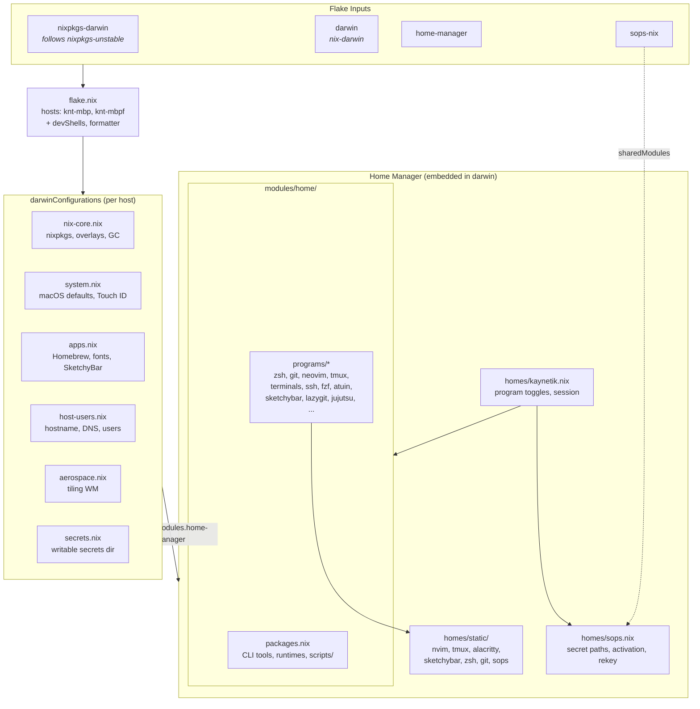
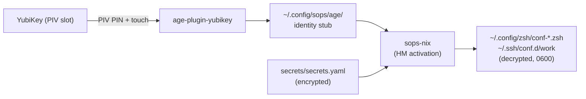

<h3 align="center">
 <br/>
 
  NixOS Config for <a href="https://github.com/kaynetik">kaynetik</a>
 
</h3>

<p align="center">
 <a href="https://github.com/kaynetik/kaynix/commits"></a>
 <a href="https://github.com/kaynetik/kaynix/actions/workflows/security.yml"></a>
 <a href="https://github.com/kaynetik/kaynix/blob/main/.github/workflows/security.yml"></a>
 <a href="https://github.com/kaynetik/kaynix/blob/main/LICENSE"></a>

 <a href="https://wiki.nixos.org/wiki/Flakes" target="_blank">
 
 </a>
</p>

---

# kaynix

Personal [nix-darwin](https://github.com/nix-darwin/nix-darwin) flake with [Home Manager](https://github.com/nix-community/home-manager) and [sops-nix](https://github.com/Mic92/sops-nix). System modules live under `modules/`; user config is `homes/kaynetik.nix`.

## Prerequisites

1. **Install Nix** via the [Determinate Systems installer](https://github.com/DeterminateSystems/nix-installer) (recommended -- enables flakes and the `nix` CLI out of the box):

```bash
curl --proto '=https' --tlsv1.2 -sSf -L \
  https://install.determinate.systems/nix | sh -s -- install
```

2. **Install [Homebrew](https://brew.sh/)** -- required for the casks and brews declared in `modules/apps.nix` (GUI apps and CLI tools not packaged in nixpkgs):

```bash
/bin/bash -c "$(curl -fsSL https://raw.githubusercontent.com/Homebrew/install/HEAD/install.sh)"
```

3. **Familiarize yourself** with `flake.nix`, `modules/`, and `homes/kaynetik.nix` before switching. For background on flakes and nix-darwin, [ryan4yin/nixos-and-flakes-book](https://github.com/ryan4yin/nixos-and-flakes-book) is a solid intro.

## First deploy

The flake defines per-host entries in the `hosts` attrset inside `flake.nix` (currently `knt-mbp` and `knt-mbpf`). Replace `HOSTNAME` below with whichever entry matches your machine, or add a new one first.

```bash
# 1. Clone the repo
git clone https://github.com/kaynetik/kaynix.git
cd kaynix

# 2. Build the system derivation
nix build .#darwinConfigurations.HOSTNAME.system

# 3. Apply (first run bootstraps nix-darwin + Home Manager)
./result/sw/bin/darwin-rebuild switch --flake .#HOSTNAME
```

Subsequent rebuilds only need step 3 (or `darwin-rebuild switch --flake .#HOSTNAME` once nix-darwin is on `$PATH`).

## Architecture



## Secrets (SOPS + YubiKey)

Secrets are encrypted at rest in `secrets/secrets.yaml`, decrypted at Home Manager activation by sops-nix. See `secrets/README.md` for editing and `yubikey.md` for the full YubiKey setup.



## Layout

```text
.
├── flake.nix          # inputs, hosts, darwinConfigurations, devShells
├── flake.lock
├── modules/           # nix-darwin system modules + modules/home/ (HM programs)
├── homes/
│   ├── kaynetik.nix   # Home Manager user config (program toggles)
│   ├── sops.nix       # sops-nix secret paths, activation, rekey script
│   └── static/        # dotfiles: nvim, tmux, alacritty, sketchybar, zsh, git
├── secrets/           # sops-encrypted secrets (see secrets/README.md)
└── scripts/           # helper scripts installed into home.packages
```
