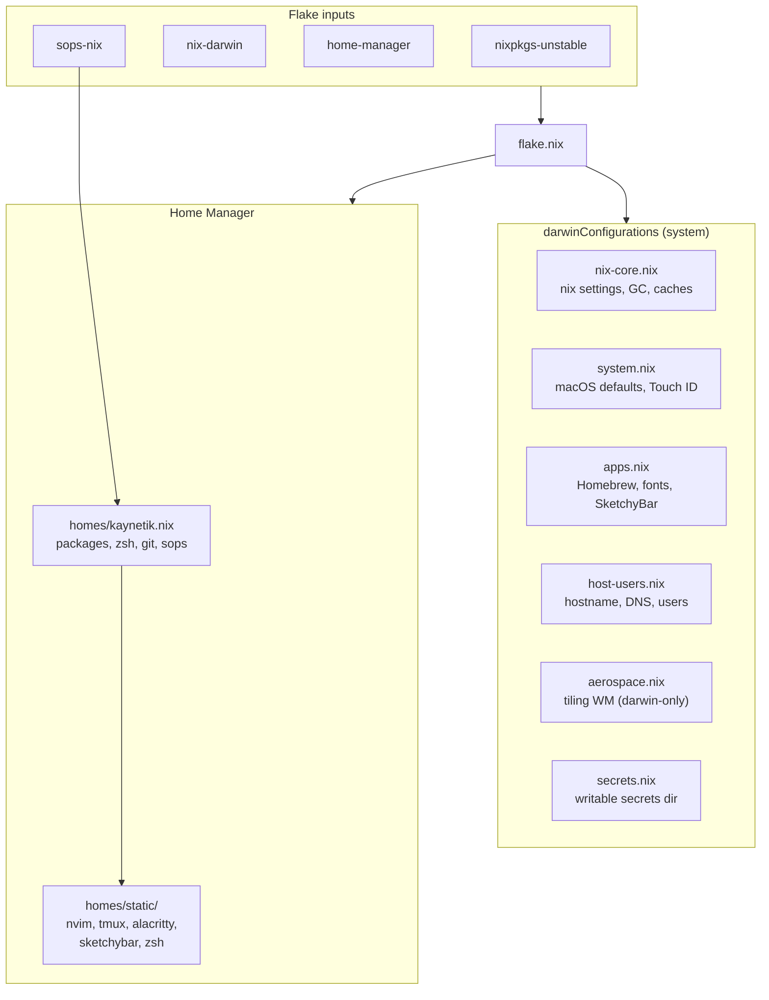
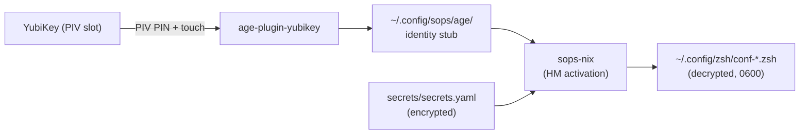

<h3 align="center">
 <br/>
 
  NixOS Config for <a href="https://github.com/kaynetik">kaynetik</a>
 
</h3>

<p align="center">
 <a href="https://github.com/khaneliman/khanelinix/stargazers"></a>
 <a href="https://github.com/khaneliman/khanelinix/commits"></a>
  <a href="https://wiki.nixos.org/wiki/Flakes" target="_blank">
 
</a>
</p>

# kaynix

Personal [nix-darwin](https://github.com/nix-darwin/nix-darwin) flake with [Home Manager](https://github.com/nix-community/home-manager) and [sops-nix](https://github.com/Mic92/sops-nix). System modules live under `modules/`; user config is `homes/kaynetik.nix`.

## Prerequisites

1. Install Nix: [nixos.org/download](https://nixos.org/download.html#download-nix) or [DeterminateSystems/nix-installer](https://github.com/DeterminateSystems/nix-installer).
2. Read `flake.nix`, `modules/`, and `homes/kaynetik.nix` before switching. For flakes and nix-darwin, [ryan4yin/nixos-and-flakes-book](https://github.com/ryan4yin/nixos-and-flakes-book) is a solid intro.
3. Install [Homebrew](https://brew.sh/) if you use the casks and brews declared in `modules/apps.nix` (GUI apps and some CLI tools not available in nixpkgs).

## First deploy

Replace `HOSTNAME` with the hostname in `flake.nix` (`hostname` in the `let` binding, currently tied to `darwinConfigurations`).

```bash
nix build .#darwinConfigurations.HOSTNAME.system \
  --extra-experimental-features 'nix-command flakes'

./result/sw/bin/darwin-rebuild switch --flake .#HOSTNAME
```

Optional `Makefile` at the repo root:

```makefile
# set HOSTNAME to match flake.nix
HOSTNAME := knt-mbp

deploy:
	nix build .#darwinConfigurations.$(HOSTNAME).system \
		--extra-experimental-features 'nix-command flakes'
	./result/sw/bin/darwin-rebuild switch --flake .#$(HOSTNAME)
```

Then run `make deploy` from the checkout.

## Architecture




## Secrets (SOPS + YubiKey)

Secrets are encrypted at rest in `secrets/secrets.yaml`, decrypted at Home Manager activation by sops-nix. See `secrets/README.md` for editing and `yubikey.md` for the full YubiKey setup.




## Layout

```text
.
├── flake.nix          # inputs, hostname, darwinConfigurations, devShells
├── flake.lock
├── modules/           # nix-darwin modules (system, apps, nix, secrets, ...)
├── homes/
│   └── kaynetik.nix   # Home Manager user config
├── secrets/           # sops-encrypted secrets (see secrets/README.md)
├── scripts/           # helper scripts installed into home.packages
├── USAGE.md           # commands and customization
└── yubikey.md         # OpenSSH sk keys, PIV, age-plugin-yubikey, SOPS
```
